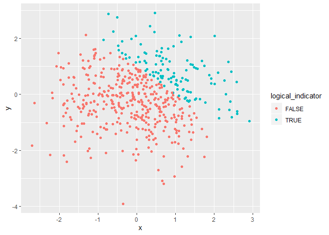
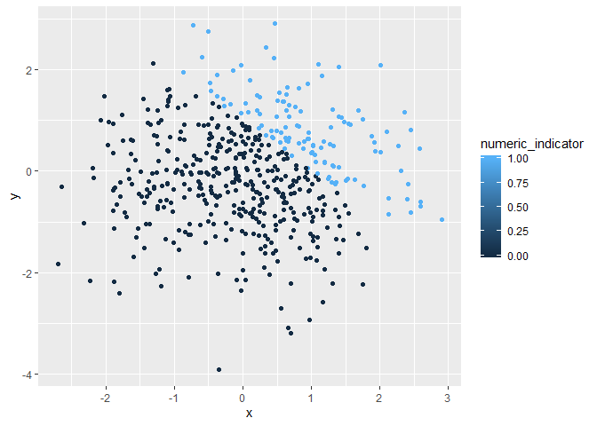
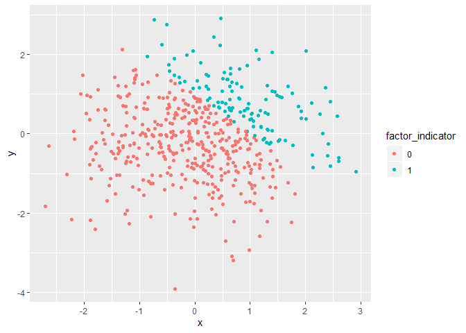

p8105\_hw1\_yj2581
================
YucongJiang
2019-9-16

Problem 1
---------

#### Create the data frame `problem_1` based on the instruction

``` r
set.seed(2581) # set the randomized seed to ensure the reproducibility

problem_1 <- tibble(
  vec_numeric = rnorm(8),
  vec_logical = vec_numeric > 0,
  vec_character = c("Tom", "Sam", "Bob", "Ivy", "Hans", "Ann", "Tony", "Roy"),
  vec_grade = factor(c("A", "B", "C", "B", "B", "A", "C", "B"))
)
```

#### Take the mean of each variable in the dataframe

-   The mean of `vec_numeric` is 0.4591903.
-   The mean of `vec_logical` is 0.5.
-   The mean of `vec_character` is NA.
-   The mean of `vec_grade` is NA.

We can see that:

-   It works when taking the mean of `vec_numeric` and `vec_logical`.
-   It doesn't work when taking the mean of `vec_character` and `vec_grade`.

#### Apply `as.numeric` function to the logical, character and factor variables

``` r
as.numeric(pull(problem_1, vec_logical))
as.numeric(pull(problem_1, vec_character))
as.numeric(pull(problem_1, vec_grade))
```

We can see that:

-   For `vec_logical`, the values `FALSE` and `TRUE` are transformed to `0` and `1` respectively.
-   For `vec_character`, it doesn't work and the results are all `NA`.
-   For `vec_grade`, it returns the underlying integer representation. Reference from R Documentation.

These results explain what happens when try to take the mean:

-   For `vec_logical`, it is coerced first and then taken the mean.
-   For `vec_character`, it doesn't work since the character cannot be converted to the numeric.
-   For `vec_grade`, the integer may not correspond to the levels, so the function refuses to take the mean.

#### Convert the logical vector to different types and multiply the random sample by the results

``` r
# Show the results and hide the warning message
logical_to_numeric <- as.numeric(pull(problem_1, vec_logical)) *
                      pull(problem_1, vec_numeric)
logical_to_numeric
```

    ## [1] 0.0000000 0.2591667 1.7277167 2.3760363 0.0000000 0.0000000 0.0000000
    ## [8] 2.1863652

``` r
logical_to_factor <- as.factor(pull(problem_1, vec_logical)) *
                     pull(problem_1, vec_numeric)
logical_to_factor
```

    ## [1] NA NA NA NA NA NA NA NA

``` r
logical_factor_numeric <- as.numeric(as.factor(pull(problem_1, vec_logical))) *
                          pull(problem_1, vec_numeric)
logical_factor_numeric
```

    ## [1] -1.3424686  0.5183333  3.4554333  4.7520725 -0.3682333 -0.2327685
    ## [7] -0.9322916  4.3727304

For `logical_to_factor`, it warns '\*' not meaningful for factors.

Problem 2
---------

#### Create the dataframe based on the instruction

``` r
set.seed(8125) # set the randomized seed to ensure the reproducibility

problem_2 <- tibble(
  x = rnorm(500),
  y = rnorm(500),
  logical_indicator = x + y > 1,
  numeric_indicator = as.numeric(logical_indicator),
  factor_indicator = as.factor(numeric_indicator)
)
```

#### Write a short description of your vector using inline R code

-   The dataset has 500 rows and 5 columns.
-   The mean of `x` is 0.0486536.
-   The median of `x` is 0.0960496.
-   The standard deviation of `x` is 1.0210402.
-   The proportion of cases for which `x + y > 1` is 0.238.

#### Make 3 scatterplots of `y` vs `x` based on the instruction; save the first scatterplot

``` r
ggplot(problem_2, aes(x = x, y = y, color = logical_indicator)) + geom_point()
```



``` r
ggsave("scatterplot_1.png") # save the first scatterplot
```

    ## Saving 7 x 5 in image

``` r
ggplot(problem_2, aes(x = x, y = y, color = numeric_indicator)) + geom_point()
```



``` r
ggplot(problem_2, aes(x = x, y = y, color = factor_indicator)) + geom_point()
```



-   For the first and third scatterplots, the variables are discrete, so the plots use 2 colors: red represents `FALSE` or `0` and cyan represents `TRUE` or `1`.
-   For the second scatterplot, the variables are continuous, so the color scales from black to blue to represent the variables from 0 to 1
